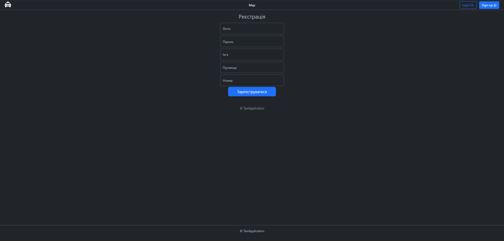
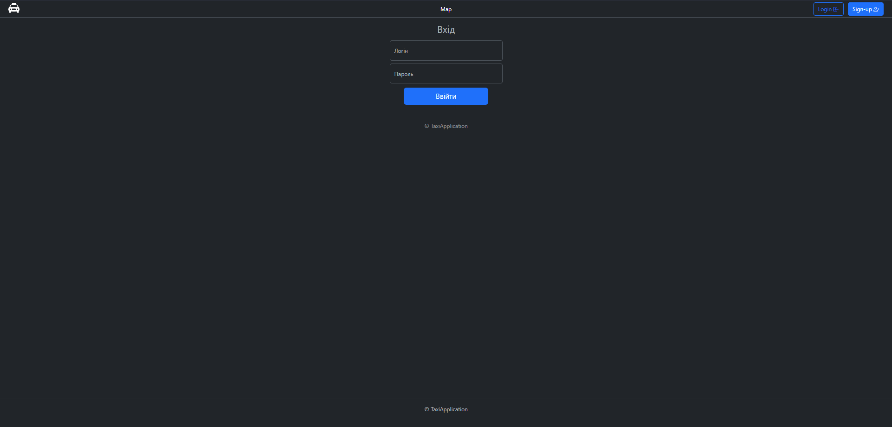
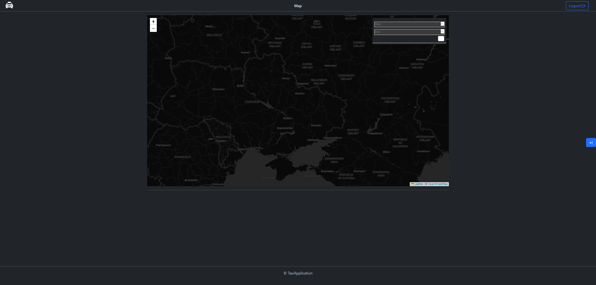
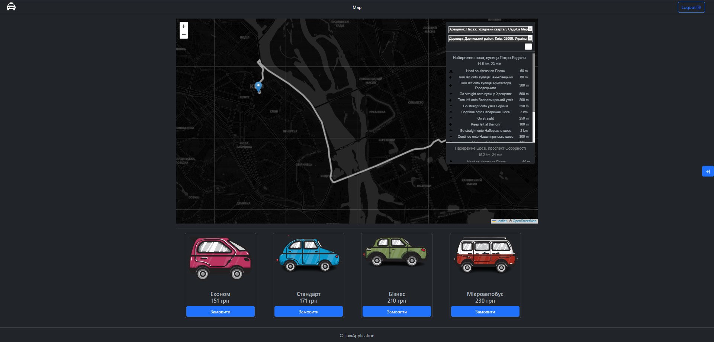
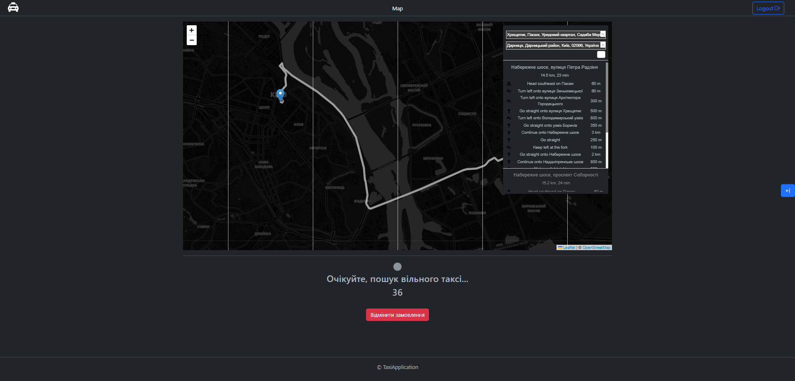
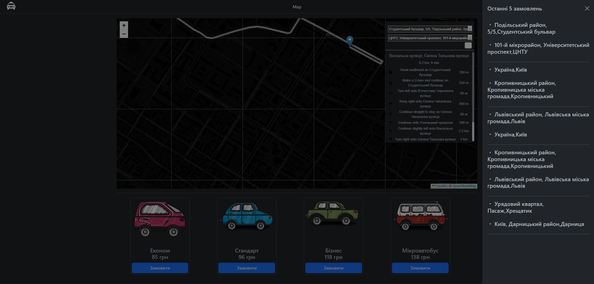

# TaxiApplication
.NET MVC Taxi Application

### Swagger url:  root/docs

<h3 align="center">Registration</h3>

For registration you need to fill in the fields:
* Login [ uniqe ]
* Password
* Name
* Surname [ not required ]
* phone [ unique ]

<h3 align="center">Login</h3>

For login you need to fill in the fields:
* Login
* Password

<h3 align="center">Map</h3>

For map used:
* JS plugin Leaflet - for map render
* OpenStreetMap - map 
* Nominatim - location search engine

<h3 align="center">Tariffs</h3>

After selecting the route you will be offered several driving tariffs:
* Econom
* Standart
* Business
* Bus

<h3 align="center">Waiting driver</h3>

After selecting driving tariff you will be waiting for a driver

<h3 align="center">Last 5 user orders list</h3>

There is also a list of the user's last 5 orders

